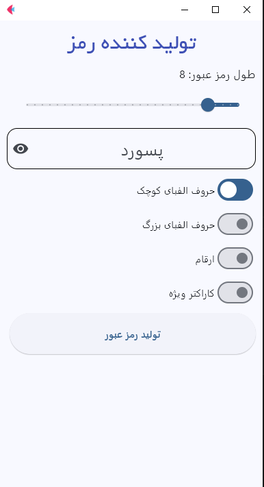

  Password Generator (Flet) :
  
A simple and user-friendly password generator application built using Flet in Python.
This app allows you to create secure, random passwords with customizable length and character options.

  Features :
  
Generate strong random passwords

Choose to include numbers, special characters, and uppercase & lowercase letters

Simple and clean interface built with Flet

Install dependencies:  
pip install flet

app screenshot

